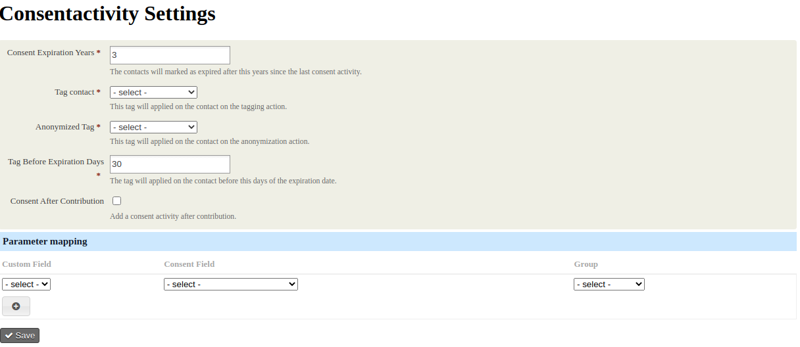
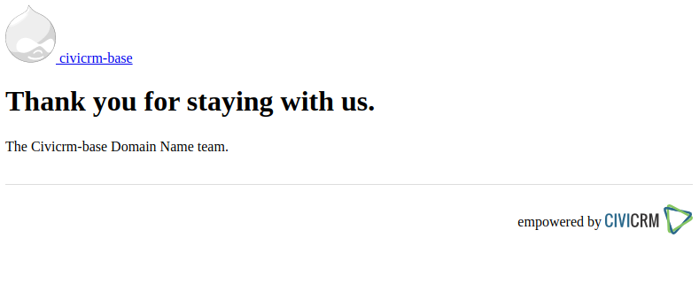

# consentactivity

[](https://github.com/reflexive-communications/consentactivity/actions/workflows/main.yml)

This extension could be used for tracking GDPR related activities. It supports the following use case:

-   The contact data could be used for N years after the consent.

## Consent

A contact gives consent when

-   submits a profile, a petition or event form.
-   creates a contribution from a form of with import (if the contribution is created in the last N years, and the feature is enabled).
-   clicks to the link that is evaluated from the `Consentactivity.consent_renewal` email token.

An activity is added to the contact when the consent is given. The date of the activity is the date of the consent. The status of the activity will be completed.
The activity type is created by the extension. If an existing activity type has to be used, you can make it happen if you change the label of the type to the extension default value, that is `GDPR Consent Activity`. Activity source and target are set to the contact, who gives consent.

The search-kit extension could be used for finding the contacts where the last consent activity was more than N years ago. This extension provides a saved search that contains the basic setup. The date field has to be updated in the Having statement.

The extension provides option to hide the privacy fields from the contacts. It lets you to define custom field checkboxes as pseudo privacy field and connect them to actual privacy fields and optionally to a group. When a profile, petition or profile form is submitted and a pseudo privacy field is checked, then the connected actual privacy field will be set to consent is given state, if it is not yet on that value. When a profile, petition or profile form is submitted and a pseudo privacy field is not checked, the actual privacy field will not be changed.

The `{Consentactivity.consent_renewal}` email token could be used to create a link that leads the contact to a page that adds the consent activity to the contact in the background.

The consent expiration is managed with cron api calls. Before the expiration a tag is added to the contact. This action could be used for triggering further actions (eg: sending emails with civirules). After the expiration the contact is anonymized with a data deletion process and the expired tag is also added to contact.

The extension is licensed under [AGPL-3.0](LICENSE.txt).

## Settings form

The settings form could be reached from the `Administer > Consentactivity Settings` menu. You can set the expiration parameters, enable or disable the consent activity after contribution and define the pseudo privacy fields.



## Consent renew page



## Requirements

-   PHP v7.3+
-   CiviCRM v5.37.1
-   RcBase v0.8.2
-   Flexmailer

## Installation (CLI, Git)

Sysadmins and developers may clone the [Git](https://en.wikipedia.org/wiki/Git) repo for this extension and
install it with the command-line tool [cv](https://github.com/civicrm/cv).

```bash
git clone git@github.com:reflexive-communications/consentactivity.git
cv en consentactivity
```

### Upgrader

When the extension is installed, it creates the default setting.

On the enable step it validates the settings that is created before. It validates the activity type. If activity type is not found it creates one and makes it active and reserved. If the config contains the tag-id key and expired-tag-key, it is also validated. If a given tag is missing, the tag and the search ids are reseted to initial values. If both tag id are valid, the search ids are needs to be checked. If the searches with the given ids are deleted (not found), new ones are created. After the validation the setting is updated with the valid values.

When the extension is uninstalled, it deletes the settings. The activity type and the activities are not changed during the uninstall process.

When the upgrade-db task is running, it checks for the existance of the setting keys. They are set with default values. The saved-search is deleted as the tag id dependency can not be handled.

### Stored configuration

The extension has in internal setting database where the following parameters are stored:

-   `activity-type-id`
-   `option-value-id`
-   `saved-search-id` The search for the expiration.
-   `tagging-search-id` The search for the tagging.
-   `tag-id` The tag id that has to be added to the contact.
-   `expired-tag-id` The tag id that has to be added to the contact after the consent expiration.
-   `consent-after-contribution` If this flag is set true, the consent activity will be triggered after the contribution.
-   `consent-expiration-years` The number of years after the consent gets expired. By default it is 3 years.
-   `consent-expiration-tagging-days` The number of days before the expiration. The tag has to be added at this time.
-   `custom-field-map` This array contains the associations between the pseudo consent fields and the actual consent fields and groups.

### Scheduled jobs

The extension provides two API endpoints and daily scheduled processes.

-   The tagging job applies a given tag to the contacts that are found by the tagging saved search. The tag is added if the lates consent activity is older than `Now - consent-expiration-years + consent-expiration-tagging-days`.
-   The expiration job deletes the contact data, sets the privacy field to not given consent state and adds the expiration-tag to the contact that are found by the expiration saved search. (The lates consent activity is older than `Now - consent-expiration-years`.)

### Deleted saved search

If the saved searches have been accidentally deleted (eg from the search kit), you can recreate them with updating the tag-id on the consentactivity settings screen.

## Database schema changes

-   The setting database has been extended with the custom-field-map, the expired-tag-id and the consent-after-contribution keys in v1.1.0.
